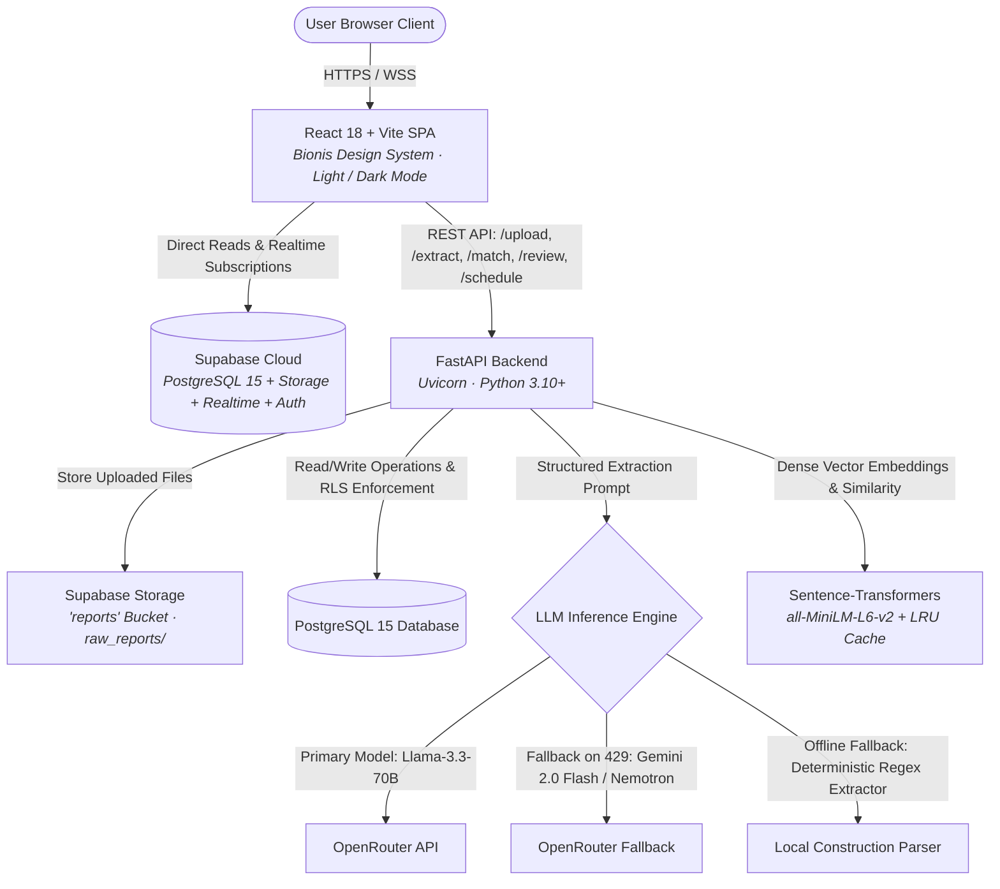

# OnGround — Infrastructure Progress Intelligence System (IPIS)

[](https://vitejs.dev/)
[](https://reactjs.org/)
[](https://www.typescriptlang.org/)
[](https://fastapi.tiangolo.com/)
[](https://www.python.org/)
[](https://supabase.com/)
[](https://huggingface.co/sentence-transformers/all-MiniLM-L6-v2)

OnGround is an AI-powered progress tracking and schedule-linking platform engineered for Engineering, Procurement, and Construction (EPC) infrastructure megaprojects. It bridges the operational gap between unstructured daily site progress reports (PDF site diaries, contractor shift logs, raw text, and tabular spreadsheets) and structured master baseline schedules (Primavera P6 / WBS).

---

## Table of Contents

1. [Project Overview](#project-overview)
2. [SIH Problem Statement Context](#sih-problem-statement-context)
3. [Current Product Purpose](#current-product-purpose)
4. [System Architecture](#system-architecture)
5. [Tech Stack](#tech-stack)
6. [Database Schema & Supabase Usage](#database-schema--supabase-usage)
7. [LLM & Extraction Architecture](#llm--extraction-architecture)
8. [Semantic Matching & Reconciliation Engine](#semantic-matching--reconciliation-engine)
9. [End-to-End Processing Workflow](#end-to-end-processing-workflow)
10. [Frontend Application Structure](#frontend-application-structure)
11. [Major Application Pages & Features](#major-application-pages--features)
12. [Bionis Design System & Global Theme](#bionis-design-system--global-theme)
13. [Authentication & Roles](#authentication--roles)
14. [Backend API Structure](#backend-api-structure)
15. [Local Development Setup](#local-development-setup)
16. [Environment Variables](#environment-variables)
17. [Testing & Build Commands](#testing--build-commands)
18. [Production Deployment](#production-deployment)
19. [Known Limitations & Prototype Boundaries](#known-limitations--prototype-boundaries)

---

## Project Overview

Infrastructure megaprojects—such as refineries, thermal power plants, metro rail networks, and multi-lane highways—frequently suffer from multi-week schedule blind spots. Daily field progress is recorded in unstructured formats across contractor shift notes, site diaries, PDF reports, and spreadsheets. Project planners routinely spend 15–20 hours each week manually reading these reports and attempting to map physical field activities to thousands of Primavera P6 WBS activities.

**OnGround automates this entire pipeline:**
1. **Multi-Format Ingestion:** Ingests raw contractor site reports across PDF, text, CSV, and Excel formats into cloud storage.
2. **Structured AI Extraction:** Uses structured LLM prompts with intelligent multi-model failover and offline fallbacks to parse raw text into normalized activity entries.
3. **Deterministic Server-Side Confidence:** Calculates mathematical extraction confidence scores based on field completeness, avoiding uncalibrated LLM self-scoring.
4. **Semantic Schedule Linking:** Maps extracted tasks to baseline WBS activities using dense vector embeddings (`all-MiniLM-L6-v2`), discipline weighting, and temporal heuristics.
5. **Human-in-the-Loop Reconciliation:** Routes matches into a three-tier confidence system (`Auto-Linked`, `Needs Review`, `Unmatched`), giving planners an intuitive disambiguation interface with 1-click confirmation, rejection, and reassignment.
6. **Immutable Audit Trail:** Logs every system decision and user resolution into a tamper-evident audit trail with actor IDs, timestamps, and confidence scores.

---

## SIH Problem Statement Context

- **Competition:** Smart India Hackathon 2026 (SIH 2026)
- **Problem Statement ID:** SIH26122
- **Title:** Infrastructure Data Capture & Schedule-Linking
- **Domain:** EPC Infrastructure Project Management & Automated Progress Intelligence
- **Category:** Software / Artificial Intelligence / Operations Research

---

## Current Product Purpose

OnGround replaces delayed manual progress reporting cycles with an automated, auditable, and accessible intelligence layer:
- **For Project Planners:** Eliminates repetitive copy-pasting from contractor logs, surfaces semantic match candidates ranked by confidence, highlights schedule discrepancies early, and records verified actuals.
- **For Site Supervisors:** Requires zero rigid forms or complex scheduling software. Supervisors can upload native site diaries directly and immediately inspect extraction feedback.
- **For Project Managers & Executives:** Delivers real-time visibility into overall project velocity, discipline-level progress breakdowns (Civil, Piping, Electrical, Instrumentation, Mechanical Equipment, HSE), and auto-link accuracy rates.
- **For Quality & Audit Officers:** Guarantees complete provenance for every confirmed progress record through an append-only database audit log.

---

## System Architecture



### Architectural Separation
- **Frontend SPA:** Single-page application built with React, Vite, and TypeScript. Implements the Bionis enterprise UI system with full Light and Dark modes, role-based controls, interactive dashboards, and responsive layouts.
- **FastAPI Backend:** Lightweight, high-throughput Python service handling file validation, text extraction, LLM orchestration, vector embedding generation, multi-factor matching, and audit trail logging.
- **Supabase Cloud:** Managed backend infrastructure providing PostgreSQL 15, S3-compatible document storage (`reports`), WebSocket-powered real-time data replication, and JWT-based authentication with Row Level Security (RLS).
- **Inference & Matching Engine:** Hybrid AI layer combining cloud LLMs (OpenRouter with automatic rate-limit failover) with local CPU-optimized embedding models (`sentence-transformers`).

---

## Tech Stack

### Frontend
- **Core:** React 18.3, TypeScript 5.5, Vite 5.4
- **Routing:** React Router v6.26
- **Styling:** Custom Vanilla CSS Design System (`frontend/src/index.css`) with CSS custom properties (Bionis Design Language)
- **Theming:** Global Light / Dark theme system with auto system-preference detection and `localStorage` persistence
- **Icons:** Lucide React (`^0.439.0`)
- **Charts & Data Visualization:** Recharts (`^3.10.1`)
- **Animation & Motion:** Motion / Framer Motion (`^13.4.0`)
- **Backend SDK:** `@supabase/supabase-js` (`^2.45.4`)

### Backend
- **Framework:** FastAPI (`>=0.110.0`) on Python 3.10+
- **ASGI Server:** Uvicorn (`>=0.28.0`)
- **Data Validation & Schemas:** Pydantic v2 (`>=2.6.0`)
- **Document Extractors:** `pdfplumber` (`>=0.10.3`), `pandas` (`>=2.2.0`), `openpyxl` (`>=3.1.2`), `python-multipart`
- **Embedding & Matching Engine:** `sentence-transformers` (`>=2.5.1`, `all-MiniLM-L6-v2`), `scikit-learn` (`>=1.4.0`), PyTorch (CPU)
- **HTTP Client:** `httpx` (`>=0.27.0`)
- **Database & Storage Client:** `supabase-py` (`>=2.3.0`)
- **Testing:** Pytest (`>=8.0.0`)

---

## Database Schema & Supabase Usage

The database runs on **Supabase PostgreSQL 15** with Row Level Security (RLS) enabled across all public tables and multi-tenant isolation functions.

### Core Tables

| Table Name | Description | Key Columns |
|---|---|---|
| `public.profiles` | User accounts linked to Supabase Auth | `id` (FK to `auth.users`), `full_name`, `role` (`planner` or `supervisor`), `created_at`, `updated_at` |
| `public.project_memberships` | Multi-tenant user access mapping | `id`, `project_id`, `user_id` (FK to `auth.users`), `role`, `created_at` |
| `public.schedule_plan` | Baseline master schedule activities (WBS) | `id`, `project_id`, `activity_code`, `activity_description`, `discipline`, `planned_start`, `planned_end` |
| `public.extractions` | Uploaded site report ingestion jobs | `id`, `project_id`, `file_url`, `file_type`, `status` (`pending`, `processing`, `complete`, `failed`), `created_at` |
| `public.extracted_activities` | Normalized tasks extracted from reports | `id`, `extraction_id`, `activity_description`, `discipline`, `start_time`, `end_time`, `location_reference`, `extraction_confidence` |
| `public.schedule_matches` | Semantic links between extracted tasks & WBS | `id`, `project_id`, `extracted_activity_id`, `schedule_plan_id`, `confidence_score`, `status` (`auto_linked`, `pending_review`, `confirmed`, `rejected`), `candidates` (JSONB) |
| `public.unmatched_activities` | Tasks with confidence $< 70\%$ requiring review | `id`, `project_id`, `extracted_activity_id`, `reason`, `suggested_action`, `created_at` |
| `public.audit_trail` | Immutable chronological system log | `id`, `project_id`, `related_match_id`, `related_unmatched_id`, `action`, `confidence_score`, `actor`, `created_at` |

### Security & Row Level Security (RLS)
- **Role Self-Promotion Protection:** PostgreSQL trigger `protect_profile_role_trigger` prevents users from altering their assigned role via client updates.
- **Multi-Tenant Access Functions:** `has_project_access(project_id)` and `is_planner()` verify user tenancy and permissions before granting read/write access.
- **Least-Privilege Backend Client:** Service-role key is restricted to server-side backend operations; client-side requests utilize Supabase anonymous/JWT tokens subject to RLS policies.
- **Storage Bucket:** Storage bucket named `reports` stores uploaded raw site documents under structured paths (`raw_reports/<timestamp>_<filename>`).

---

## LLM & Extraction Architecture

### 1. Structured Construction Prompt
The extraction engine directs LLMs using a domain-specific system prompt designed for EPC construction terminology. The model parses unconstrained text into normalized JSON containing:
- `activity_description`: Specific physical work performed (e.g., *"Fit-up and root pass welding of 12-inch CS cooling water line"*).
- `discipline`: Standardized to one of `civil`, `piping`, `electrical`, `instrumentation`, `static_rotating_equipment`, `hse`, or `unknown`.
- `start_time` / `end_time`: ISO 8601 formatted timestamps or date strings.
- `location_reference`: Unit, zone, chainage, elevation, or area grid coordinates.

### 2. Multi-Model Failover Mechanism
Free-tier and shared LLM APIs often return HTTP 429 (`Rate limit exceeded: free-models-per-day`). OnGround incorporates an intelligent failover architecture in `backend/llm/openrouter.py`:
- **Primary Model:** `meta-llama/llama-3.3-70b-instruct:free` (configurable via `LLM_MODEL`).
- **Configured Fallbacks:** `google/gemini-2.0-flash-exp:free`, `liquid/lfm-2.5-2.6b:free`, and `nvidia/nemotron-3.5-lightning:free`.
- **Immediate Failover:** On receiving HTTP 429 or service unavailability, the engine immediately attempts the next fallback model without executing wasteful retry loops.
- **Deterministic Offline Fallback:** If all remote LLMs fail or no API key is present, OnGround automatically switches to a regex-based deterministic extraction engine that parses structured shift diaries and daily progress reports directly.

### 3. Server-Side Deterministic Confidence Scoring
Rather than relying on uncalibrated LLM self-reported confidence, OnGround calculates extraction confidence deterministically based on field presence and syntactic validity:
$$\text{Confidence} = w_{\text{desc}} \cdot S_{\text{desc}} + w_{\text{disc}} \cdot S_{\text{disc}} + w_{\text{time}} \cdot S_{\text{time}} + w_{\text{loc}} \cdot S_{\text{loc}}$$

---

## Semantic Matching & Reconciliation Engine

The matching service (`backend/services/matching_service.py`) maps each extracted task against the project's baseline WBS schedule using a multi-factor hybrid scoring algorithm.

### 1. Dense Vector Embeddings
- Utilizes the `all-MiniLM-L6-v2` SentenceTransformer model (384-dimensional dense vectors).
- Generates vector embeddings for extracted task descriptions and active baseline schedule activities.
- Implements a thread-safe, bounded LRU cache (`EmbeddingCache`) with SHA-256 content-aware keys to prevent redundant embedding computation.

### 2. Multi-Factor Scoring Formula
The final match score ($S_{\text{match}} \in [0.0, 1.0]$) blends:
1. **Semantic Cosine Similarity ($S_{\text{semantic}}$):** Vector cosine similarity between task description and WBS activity description.
2. **Discipline Concordance ($S_{\text{discipline}}$):** Boosted when disciplines match exactly; penalized when conflicting (e.g., Civil task mapped to Electrical WBS).
3. **Keyword & Contextual Heuristics ($S_{\text{heuristic}}$):** Substring and token overlap for equipment tags, line numbers, and area designations.
4. **Temporal Proximity ($S_{\text{temporal}}$):** Proximity between the report date and planned start/finish dates in the schedule.

### 3. Three-Tier Confidence Banding
```
                        ┌────────────────────────────────────────────────────────┐
                        │              Match Confidence Score (0 - 100%)         │
                        └────────────────────────────────────────────────────────┘
                                                    │
             ┌──────────────────────────────┬───────┴──────────────────────┬─────────────────────────────┐
             ▼                              ▼                              ▼                             ▼
   [ 0% —————————— 69% ]         [ 70% —————————— 84% ]         [ 85% —————————— 100% ]          [ 0 Candidate Match ]
       UNMATCHED                     NEEDS REVIEW                    AUTO-LINKED                      UNMATCHED
  • Isolated to backlog          • Ranked top-3 candidates      • Direct schedule linking        • Flagged for site query
  • Manual assignment pool       • Sent to Planner Queue        • Automatic audit log            • Supervisor investigation
```

- **Auto-Linked ($\ge 85\%$):** High-confidence matches are linked directly to the baseline schedule and recorded in the audit trail.
- **Needs Review ($70\% - 84\%$):** Moderate matches are routed to the planner review queue with ranked candidate suggestions and match rationale.
- **Unmatched ($< 70\%$):** Low-confidence tasks are safely isolated for manual assignment or contractor clarification.

---

## End-to-End Processing Workflow

```
[ Step 1: Ingest File to Storage ]
  │  • Upload PDF, Excel, CSV, or text report via drag-and-drop
  │  • Magic byte validation and size checks
  │  • Stored in Supabase 'reports' bucket (raw_reports/<timestamp>_<file>)
  │  • Job record created in public.extractions (status: 'processing')
  ▼
[ Step 2: AI Activity Extraction & Confidence ]
  │  • Text extraction via pdfplumber / pandas
  │  • OpenRouter LLM extraction (Llama 3.3 70B → Gemini 2.0 → Nemotron → Offline fallback)
  │  • Deterministic confidence calculation per activity
  │  • Records written to public.extracted_activities
  ▼
[ Step 3: Sentence-Transformer Vector Matching ]
  │  • all-MiniLM-L6-v2 dense vector embeddings with LRU cache
  │  • Cosine similarity against active WBS schedule activities
  │  • Multi-factor discipline, keyword, and date proximity weighting
  │  • Candidates scored and categorized into 3 confidence bands
  ▼
[ Step 4: Database Reconciliation & Audit Trail ]
  │  • High-confidence (≥85%) auto-linked in public.schedule_matches
  │  • Review-needed (70-84%) populated with ranked candidate JSONB
  │  • Low-confidence (<70%) recorded in public.unmatched_activities
  │  • Full event logged to public.audit_trail
  ▼
[ Realtime UI Update ]
  • Client updates automatically via Supabase Realtime / WebSocket subscriptions
```

---

## Frontend Application Structure

The frontend is organized into a modular hierarchy:

```
frontend/src/
├── api/
│   ├── apiClient.ts               # Axios / Fetch client for FastAPI backend endpoints
│   └── apiService.ts              # Workspace data management and local state persistence
├── assets/                        # Static assets and cinematic background imagery
├── components/
│   ├── common/                    # Shared UI primitives
│   │   ├── BionisChartTooltip.tsx # High-contrast glassmorphic tooltip for Recharts
│   │   ├── KPICard.tsx            # Bionis ambient metric card with trend indicator
│   │   ├── ScoreDonut.tsx         # Circular SVG progress gauge with color accents
│   │   ├── StatusPill.tsx         # Color-coded badge for confidence & match states
│   │   └── ThemeToggle.tsx        # Accessible Sun/Moon light/dark mode switcher
│   ├── hero/                      # Landing page Hero14 cinematic banner
│   ├── layout/                    # Application shells
│   │   ├── AppLayout.tsx          # Portfolio-level layout (topbar, navigation)
│   │   ├── ProjectWorkspaceLayout.tsx # Project workspace shell (collapsible sidebar, topbar)
│   │   └── PublicLayout.tsx       # Marketing layout (public navbar, footer)
│   ├── public/                    # Marketing navigation and footer
│   ├── review/                    # Disambiguation cards and candidate comparison modals
│   ├── schedule/                  # WBS tree views, timeline bars, filter toolbars
│   ├── ui/                        # Accessible primitive components (buttons, dropdowns)
│   └── upload/                    # File dropzone, format pills, 4-step processing stepper
├── context/
│   ├── ProjectContext.tsx         # Multi-project selection and active project state
│   └── ThemeContext.tsx           # Global Light / Dark theme provider and persistence
├── hooks/
│   ├── AuthProvider.tsx           # Supabase Auth provider with role state
│   └── useAuth.tsx                # Authentication hook (user, role, session handling)
├── lib/
│   ├── types.ts                   # TypeScript domain interfaces (Project, WBS, Match, Activity)
│   └── utils.ts                   # Class merging (`cn`), formatting, date utilities
├── pages/
│   ├── app/                       # Portfolio-level views (Dashboard, Projects, Create)
│   ├── auth/                      # Authentication flows (Login, Signup, Forgot, Reset, Verify)
│   ├── project/                   # Project workspace sub-routes (11 distinct modules)
│   └── public/                    # Marketing pages (Home, Features, Pricing, Docs, etc.)
├── App.tsx                        # Route hierarchy, layout bindings, and redirects
├── index.css                      # Core design system tokens, Bionis primitives, themes
└── main.tsx                       # React DOM root entry point
```

---

## Major Application Pages & Features

### 1. Public Marketing Website
- **Landing Page (`/`):** Features the cinematic `Hero14` banner with motion animations, problem-to-solution narrative, interactive Bento feature grid, product showcase simulator, and role-based benefits.
- **Product & Company Pages:** `/features`, `/how-it-works`, `/solutions`, `/pricing`, `/about`, `/contact`, `/docs`, `/security`, `/faq`, `/privacy`, `/terms`, `/cookies`.

### 2. Authentication Flow
- **Login (`/login`):** Role-tailored sign-in with instant **Demo Account Persona Switcher** (`Project Planner` vs. `Site Supervisor`), session expiration detection, and theme toggle.
- **Account Management:** `/signup`, `/forgot-password`, `/reset-password`, `/verify-email`.

### 3. Portfolio Application Shell
- **Portfolio Dashboard (`/dashboard`):** Cross-project visibility displaying overall progress scores, active project counts, reconciliation velocity, and discipline distribution charts.
- **Projects Directory (`/projects`):** Project directory with search, status filters, progress bars, and budget/timeline metrics.
- **Create Project (`/projects/new`):** New project onboarding with discipline scope, client name, and budget allocation.

### 4. Project Workspace Modules (`/projects/:id/...`)
1. **Overview (`overview`):** Bionis key metric cards, overall progress donut gauge, 14-day velocity chart, discipline factor bars, and critical path risk indicators.
2. **Master Schedule (`schedule`):** Baseline Primavera P6 WBS table with activity codes, descriptions, planned start/end dates, weightages, and progress status.
3. **Activities (`activities`):** Extracted field activities stream with discipline badges, timestamp parsing, and confidence ratings.
4. **Reports (`reports`):** Ingestion history table showing uploaded files, extraction status, activity counts, and processing duration.
5. **Upload Report (`reports/upload`):** Drag-and-drop file upload supporting PDF, Excel, CSV, and text reports with real-time 4-step progress stepper (`Ingest` → `Extraction` → `Vector Matching` → `Audit Log`).
6. **Processing Timeline (`processing`):** Detailed status monitor for active asynchronous extraction jobs.
7. **Reconciliation Dashboard (`reconciliation`):** Master reconciliation control center segmented by status tabs (`All`, `Auto-Linked`, `Needs Review`, `Unmatched`) with quick-action review triggers.
8. **Candidate Review & Disambiguation (`review` & `review/:matchId`):** Side-by-side comparison of raw field report excerpts against ranked baseline WBS candidates, showing similarity scores, discipline alignment, and 1-click `Confirm`, `Reject`, or `Reassign` controls.
9. **Unmatched Backlog (`unmatched`):** Quarantine area for unlinked tasks ($< 70\%$ confidence) allowing planners to link manually or request site clarifications.
10. **Analytics (`analytics`):** Deep-dive reporting on reconciliation velocity, auto-link accuracy trends, discipline completion rates, and contractor performance.
11. **Audit Trail (`audit`):** Append-only chronological timeline recording all system and user resolutions with actor badges, timestamps, confidence scores, and previous state history.
12. **Team & Permissions (`team`):** Project team roster with role badges and access control settings.
13. **Project Settings (`settings`):** Project metadata, tolerance thresholds, and discipline configuration.

---

## Bionis Design System & Global Theme

OnGround implements a unified enterprise design language adapted from the Bionis visual architecture, supporting seamless **Light Mode** and **Dark Mode**.

### 1. Global Theming Architecture
- Managed via `ThemeContext` and toggled with the accessible `ThemeToggle` component.
- Supports `light` and `dark` modes with instantaneous CSS variable switching on `document.documentElement`.
- Automatically respects system preferences via `prefers-color-scheme` if no explicit selection has been stored.
- Persists user preferences reliably in browser `localStorage` (`onground_theme`).

### 2. Palette & Visual Language

| Design Element | Dark Mode (Default) | Light Mode |
|---|---|---|
| **App Background** | `#0a0e17` | `#f8fafc` |
| **Secondary Surface** | `#0f172a` | `#f1f5f9` |
| **Card / Container** | `#141c2e` / `#1e293b` | `#ffffff` |
| **Primary Typography** | `#f8fafc` (crisp white) | `#0f172a` (slate dark) |
| **Secondary Typography** | `#94a3b8` (muted slate) | `#475569` (slate gray) |
| **Borders & Dividers** | `rgba(255, 255, 255, 0.08)` | `rgba(15, 23, 42, 0.08)` |
| **Accent Primary** | `#38bdf8` (sky blue) | `#0284c7` (deep blue) |
| **Success / Auto-Link** | `#10b981` / `rgba(16, 185, 129, 0.12)` | `#059669` / `rgba(5, 150, 105, 0.10)` |
| **Review / Warning** | `#f59e0b` / `rgba(245, 158, 11, 0.12)` | `#d97706` / `rgba(217, 119, 6, 0.10)` |
| **Unmatched / Alert** | `#ef4444` / `rgba(239, 68, 68, 0.12)` | `#dc2626` / `rgba(220, 38, 38, 0.10)` |

### 3. Reusable Bionis Primitives
- `.bionis-card`: Rounded cards with subtle borders and ambient glow accent gradients (`glow-blue`, `glow-indigo`, `glow-emerald`, `glow-amber`, `glow-rose`).
- `.bionis-metric-card`: Key performance metric card with icon container, tabular value, and trend pill.
- `.bionis-factor-row`: Discipline progress factor bar with track and animated fill.
- `.bionis-chart-tooltip`: Adaptive glassmorphic tooltip for Recharts components with high-contrast text.

---

## Authentication & Roles

### User Roles
1. **Project Planner:**
   - Full administrative and operational authority.
   - Authority to confirm, reject, or reassign schedule matches.
   - Capability to edit baseline schedules and adjust project parameters.
2. **Site Supervisor:**
   - Ingestion and operational monitoring authority.
   - Can upload daily progress reports, inspect extraction status, and review audit trails.
   - Confirmation and rejection controls are disabled to preserve schedule integrity.

### Evaluator Persona Switcher
For seamless demonstration during evaluations, OnGround includes two role-switching mechanisms:
- **Login Screen Persona Selector:** Instantly switches credentials and roles between Demo Planner and Demo Supervisor.
- **Global Topbar Role Switcher:** Authenticated users can toggle active role views dynamically in the header to evaluate permission-based interface adaptations.

---

## Backend API Structure

| HTTP Method | Endpoint | Description | Auth Required |
|---|---|---|---|
| `GET` | `/health` | Service liveness probe and version check | No |
| `POST` | `/upload` | Upload daily site report to Supabase Storage | Yes (Bearer token) |
| `POST` | `/extract` | Parse uploaded file and extract construction activities | Yes (Bearer token) |
| `POST` | `/extract/{id}` | Re-trigger or inspect extraction job by ID | Yes (Bearer token) |
| `POST` | `/match` | Execute vector embedding matching against baseline WBS | Yes (Bearer token) |
| `POST` | `/match/{id}` | Run match pipeline for an individual activity | Yes (Bearer token) |
| `POST` | `/match/{id}/confirm` | Confirm candidate match and update schedule actuals | Yes (Planner only) |
| `POST` | `/match/{id}/reject` | Reject match candidate and route to review backlog | Yes (Planner only) |
| `POST` | `/match/{id}/reassign` | Manually reassign match to a specific WBS activity | Yes (Planner only) |
| `GET` | `/schedule` | Retrieve active project baseline schedule | Yes (Bearer token) |
| `POST` | `/schedule/import` | Import new WBS activities from structured CSV/Excel | Yes (Planner only) |
| `GET` | `/reports` | Retrieve list of ingested reports and extraction statuses | Yes (Bearer token) |
| `GET` | `/analytics` | Retrieve reconciliation velocity, accuracy, and discipline metrics | Yes (Bearer token) |
| `GET` | `/audit` | Retrieve immutable audit trail records | Yes (Bearer token) |

---

## Local Development Setup

### Prerequisites
- Node.js 18.x or higher and npm
- Python 3.10 or higher
- Supabase account with active PostgreSQL project
- OpenRouter API key (free-tier models supported)

### 1. Clone the Repository
```bash
git clone https://github.com/Shourya-stack/OnGround.git
cd OnGround
```

### 2. Backend Setup
```bash
# Create and activate Python virtual environment
python -m venv .venv

# On Windows:
.venv\Scripts\activate
# On Linux / macOS:
# source .venv/bin/activate

# Install Python dependencies
pip install -r backend/requirements.txt

# Configure environment variables
copy backend\.env.example backend\.env
# (On Linux/macOS: cp backend/.env.example backend/.env)
# Edit backend/.env with your Supabase and OpenRouter credentials

# Start FastAPI server on port 8000
python -m uvicorn backend.main:app --reload --port 8000
```

### 3. Frontend Setup
```bash
# In a new terminal window:
cd frontend

# Install dependencies
npm install

# Configure environment variables
copy .env.example .env
# (On Linux/macOS: cp .env.example .env)
# Edit frontend/.env with your Supabase URL, Anon Key, and API Base URL

# Start Vite development server
npm run dev
```

Open `http://localhost:5173` (or `http://localhost:5174`) in your browser to view the application.

---

## Environment Variables

> **Security Notice:** Never commit actual secrets, API keys, service keys, or `.env` files to source control. Secret keys must be supplied exclusively through local `.env` files or secure cloud provider dashboards.

### Frontend (`frontend/.env`)
| Variable Name | Required | Description | Example / Default |
|---|---|---|---|
| `VITE_SUPABASE_URL` | Yes | Supabase project URL | `https://your-project.supabase.co` |
| `VITE_SUPABASE_ANON_KEY` | Yes | Supabase public anonymous API key | `eyJhbGciOiJIUz...` |
| `VITE_API_BASE_URL` | Yes | FastAPI backend root URL | `http://localhost:8000` |

### Backend (`backend/.env`)
| Variable Name | Required | Description | Example / Default |
|---|---|---|---|
| `SUPABASE_URL` | Yes | Supabase project URL | `https://your-project.supabase.co` |
| `SUPABASE_SERVICE_KEY` | Yes | Supabase privileged service-role key (bypasses RLS) | `eyJhbGciOiJIUz...` |
| `OPENROUTER_API_KEY` | Optional | API key for OpenRouter LLM inference | `sk-or-v1-...` |
| `LLM_PROVIDER` | No | LLM provider identifier | `openrouter` |
| `LLM_MODEL` | No | Primary extraction LLM model | `meta-llama/llama-3.3-70b-instruct:free` |
| `ENVIRONMENT` | No | Execution environment (`development`, `production`) | `development` |
| `PORT` | No | Port number for Uvicorn server | `8000` |
| `HOST` | No | Host bind address | `0.0.0.0` |
| `FRONTEND_URL` | No | Allowed frontend origin for CORS | `http://localhost:5173` |
| `ALLOWED_ORIGINS` | No | Comma-separated list of allowed CORS origins | `http://localhost:5173,http://localhost:5174` |
| `RATE_LIMIT_UPLOAD` | No | Upload rate limiting threshold | `10/minute` |
| `RATE_LIMIT_EXTRACTION`| No | Extraction rate limiting threshold | `10/minute` |
| `RATE_LIMIT_MATCH` | No | Match endpoint rate limiting threshold | `30/minute` |

---

## Testing & Build Commands

### Frontend Build & Typecheck
```bash
cd frontend
npm run build
```
*Validates all TypeScript definitions and compiles production assets with Vite.*

### Backend Automated Test Suite
```bash
# From repository root with virtual environment activated:
python -m pytest backend/tests -v
```
*Executes the automated test suite covering auth validation, route security, RLS policies, LLM failover logic, storage path resolution, and semantic matching.*

---

## Production Deployment

| Component | Platform | Configuration File | Notes |
|---|---|---|---|
| **Frontend SPA** | Vercel | `frontend/vercel.json` | Single-page application rewrites to `/index.html` |
| **Backend API** | Render | `render.yaml` / `Dockerfile` | Containerized Python 3.10+ FastAPI service with Uvicorn |
| **Database & Storage** | Supabase Cloud | Managed PostgreSQL 15 | S3-compatible `reports` bucket and RLS policies |
| **AI Inference** | OpenRouter | Remote HTTPS | Free-tier and high-throughput model endpoints |

---

## Known Limitations & Prototype Boundaries

In keeping with engineering transparency, the following prototype boundaries are documented:

1. **Primavera P6 / WBS Integration:**
   - In this prototype, baseline schedules are imported via structured CSV, XLSX, or XML schedule exports.
   - A direct, real-time bidirectional integration using Oracle Primavera Cloud / P6 EPPM Web Services API is an enterprise roadmap item and is not required for core schedule-linking validation.
2. **Scanned Raster PDFs:**
   - Extraction operates on selectable text-based PDF documents, text logs, CSVs, and Excel workbooks using `pdfplumber` and `openpyxl`.
   - Photocopied raster image scans without OCR text layers require pre-processing via OCR engines before ingestion.
3. **Role Enforcement in Demo Mode:**
   - For evaluation ease, the active role can be switched dynamically in the UI header and login view. In a strict corporate enterprise setup, role claims would be locked strictly to authenticated SAML / OAuth corporate SSO JWT claims.
4. **Client State vs. Live Database Multi-Tenancy:**
   - The primary pipeline endpoints (`/upload`, `/extract`, `/match`, `/review`, `/schedule`) execute directly against live Supabase PostgreSQL and Storage tables.
   - Secondary portfolio project metadata in the frontend utilizes local client persistence (`localStorage`) alongside backend mock services during demonstration mode.

---

## License

This project is developed for the **Smart India Hackathon 2026 (SIH26122)**. All rights reserved.
