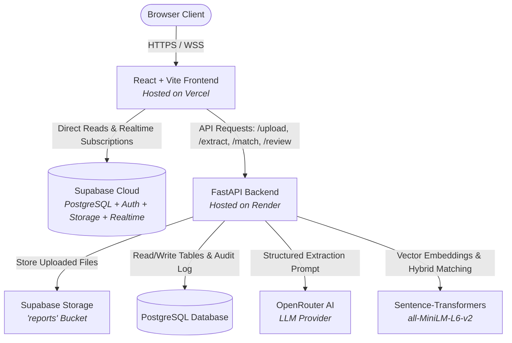

# OnGround

OnGround is an AI-powered progress tracking and schedule reconciliation platform designed for engineering, procurement, and construction (EPC) infrastructure projects. It bridges the critical operational gap between unstructured daily site progress reports (PDFs, shift logs, text notes, and tabular spreadsheets) and structured project baseline schedules (Primavera P6 / WBS).

---

## Overview

Infrastructure megaprojects frequently suffer from multi-week schedule blind spots because daily field progress is submitted in unstructured formats—contractor shift notes, daily logs, PDF reports, and spreadsheets. Project planners typically spend 15–20 hours each week manually reading these reports and attempting to map physical field activities to thousands of Primavera P6 WBS activities.

OnGround automates this pipeline:
1. Ingests raw multi-format daily site reports.
2. Extracts individual physical construction tasks using structured LLM parsing.
3. Computes deterministic confidence metrics server-side.
4. Semantically matches extracted tasks to active baseline WBS schedule activities using dense vector embeddings and contextual heuristics.
5. Provides a dedicated reconciliation interface where planners can review candidate suggestions, disambiguate low-confidence matches, and confirm schedule updates with complete auditability.

---

## Key Capabilities

- **Multi-Format Daily Report Ingestion:** Upload and parse daily logs across PDF documents, raw text reports, CSV logs, and Excel spreadsheets.
- **Structured Activity Extraction:** Parses messy field text into normalized activity entries with description, EPC discipline (`civil`, `piping`, `electrical`, `instrumentation`, `static_rotating_equipment`, `hse`), ISO timestamps, and location references.
- **Deterministic Server-Side Confidence Scoring:** Confidence scores are calculated mathematically based on field completeness, rather than relying on uncalibrated LLM self-scoring.
- **Semantic Schedule Activity Matching:** Utilizes `sentence-transformers` (`all-MiniLM-L6-v2`) embeddings combined with discipline filtering, temporal proximity, and contextual similarity scoring.
- **Three-Tier Confidence Banding:**
  - **Auto-Linked ($\ge 85\%$):** High-confidence matches are automatically linked directly to the baseline schedule.
  - **Needs Review ($70\% - 84\%$):** Moderate matches are routed to the planner review queue with ranked candidate suggestions.
  - **Unmatched ($< 70\%$):** Low-confidence tasks are safely isolated for manual assignment.
- **Planner Review & Disambiguation Workflow:** Side-by-side inspection of raw field activity details against top ranked baseline schedule candidates with 1-click confirmation or rejection.
- **Append-Only Immutable Audit Trail:** Chronological record of all system and user actions, documenting state changes, timestamps, and actor roles.
- **Realtime State Synchronization:** Powered by Supabase Realtime subscriptions for immediate UI updates across upload, reconciliation, review, and audit views.
- **Role-Based Experience:** Differentiated capabilities for Project Planners (full review and confirmation authority) and Site Supervisors (ingestion and read-only visibility).
- **Executive Intelligence Dashboard:** Real-time visibility into overall project progress, auto-link accuracy rates, discipline distribution, and pending review workloads.

---

## System Architecture



Supabase provides the managed PostgreSQL database, document storage bucket (`reports`), user session management, and WebSocket realtime replication engine. The FastAPI backend orchestrates file parsing, LLM provider integration, semantic embedding vector computation, and audit trail logging.

---

## Tech Stack

### Frontend
- **Framework:** React 18 with TypeScript
- **Build Tool:** Vite 5
- **Routing:** React Router v6
- **Icons:** Lucide React
- **Design System:** Custom tokenized CSS design system (`index.css`) with dark-mode EPC palette
- **Client Libraries:** `@supabase/supabase-js`

### Backend
- **Framework:** FastAPI (Python 3.10+)
- **Data Validation:** Pydantic v2
- **Document Extractors:** `pdfplumber`, `pandas`, `openpyxl`, `python-multipart`
- **Embedding & Matching Engine:** `sentence-transformers` (`all-MiniLM-L6-v2`), `numpy`, `scikit-learn`, `torch` (CPU)
- **HTTP Client:** `httpx`
- **Database Client:** `supabase-py`

### Cloud Infrastructure
- **Database & Storage:** Supabase Cloud (PostgreSQL 15, Storage, Realtime)
- **Frontend Hosting:** Vercel
- **Backend Hosting:** Render

---

## Workflow

```
[ Daily Site Report Upload ]
           │
           ▼
[ Text Extraction & Normalization ]
           │
           ▼
[ OpenRouter LLM Activity Parsing ]
           │
           ▼
[ Deterministic Confidence Calculation ]
           │
           ▼
[ Vector Embedding & Schedule Matching ]
           │
           ├────────────────────────┬────────────────────────┐
           ▼                        ▼                        ▼
[ Auto-Linked (≥ 85%) ]    [ Needs Review (70-84%) ]    [ Unmatched (< 70%) ]
           │                        │                        │
           │                        ▼                        ▼
           │              [ Planner Review UI ]      [ Manual Pool ]
           │                        │
           │              ┌─────────┴─────────┐
           │              ▼                   ▼
           │        [ Confirmed ]       [ Rejected ]
           │              │                   │
           ▼              ▼                   ▼
      [ Live Baseline Schedule Update & Immutable Audit Trail Log ]
```

---

## Roles & Access Control

- **Project Planner:** Full operational authority. Can confirm or reject matches, reassign candidate activities, and update the baseline schedule.
- **Site Supervisor:** Ingestion-focused role. Can upload daily reports, view dashboards, inspect reconciliation progress, and review audit logs. Match confirmation and rejection actions are disabled.
- **Demo Role Switcher:** For demonstration purposes, a role toggle in the top navigation bar allows evaluators to seamlessly switch between Planner and Supervisor views to test role-based UI restrictions.

---

## Local Development

### Prerequisites
- Node.js 18+ and npm
- Python 3.10+
- Active Supabase project and OpenRouter API key

### 1. Backend Setup

```bash
# Clone the repository
git clone https://github.com/Shourya-stack/OnGround.git
cd OnGround

# Create and activate Python virtual environment
python -m venv .venv
# On Windows:
.venv\Scripts\activate
# On Linux/macOS:
# source .venv/bin/activate

# Install dependencies
pip install -r backend/requirements.txt

# Configure environment variables
cp backend/.env.example backend/.env
# Edit backend/.env with your Supabase and OpenRouter credentials

# Start FastAPI server
python -m uvicorn backend.main:app --reload --port 8000
```

### 2. Frontend Setup

```bash
cd frontend

# Install dependencies
npm install

# Configure environment variables
cp .env.example .env
# Edit frontend/.env with your Supabase URL, Anon Key, and API Base URL

# Start Vite development server
npm run dev
```

Open `http://localhost:5173` in your browser.

---

## Environment Variables

> **Note:** Never commit secrets or `.env` files to source control. Secret keys must always be supplied via environment variables or cloud provider dashboard settings.

### Frontend (`frontend/.env`)
| Variable | Description |
|---|---|
| `VITE_SUPABASE_URL` | Supabase project URL (`https://<project-id>.supabase.co`) |
| `VITE_SUPABASE_ANON_KEY` | Supabase public anonymous API key |
| `VITE_API_BASE_URL` | Backend API URL (`http://localhost:8000` or deployed backend URL) |

### Backend (`backend/.env`)
| Variable | Description |
|---|---|
| `SUPABASE_URL` | Supabase project URL |
| `SUPABASE_SERVICE_KEY` | Supabase privileged service-role key (used for server-side writes) |
| `OPENROUTER_API_KEY` | API key for OpenRouter LLM inference |
| `LLM_MODEL` | Target extraction model (default: `liquid/lfm-2.5-2.6b:free`) |
| `FRONTEND_URL` | Allowed frontend origin for CORS |
| `HOST` | Server bind host (default: `0.0.0.0`) |
| `ENVIRONMENT` | Runtime environment (`development` or `production`) |

---

## Deployment

| Component | Platform | Canonical URL |
|---|---|---|
| **Frontend** | Vercel | [https://on-ground.vercel.app](https://on-ground.vercel.app) |
| **Backend** | Render | [https://onground.onrender.com](https://onground.onrender.com) |
| **Database / Storage** | Supabase Cloud | Managed PostgreSQL & S3-compatible Storage |
| **AI Extraction** | OpenRouter | Remote Inference |

---

## SIH Context

- **Event:** Smart India Hackathon 2026
- **Problem Statement:** SIH26122 (Infrastructure Data Capture & Schedule-Linking)
- **Domain:** EPC Infrastructure Project Management & Automated Progress Intelligence

---

## Project Status

OnGround is a hackathon-ready deployed prototype. The core pipeline—including multi-format report parsing, LLM entity extraction, vector embedding matching against baseline WBS schedules, planner disambiguation, and audit trail logging—is implemented and verified with automated test suites and live cloud services.

---

## Security & Prototype Boundaries

- **Demo Role Mechanism:** The UI role toggle operates via client session state and custom request headers (`X-User-Role`) for demonstration convenience. In an enterprise production deployment, this would be replaced with strict JWT claims and server-validated OAuth 2.0 / SAML authentication.
- **Baseline Schedule Integration:** The current system imports Primavera P6 / WBS schedules via structured CSV/XML exports rather than a direct Oracle Primavera EPPM API integration.
- **Offline Resilience:** The backend includes a local fallback extractor for environments with limited internet connectivity during field trials.
