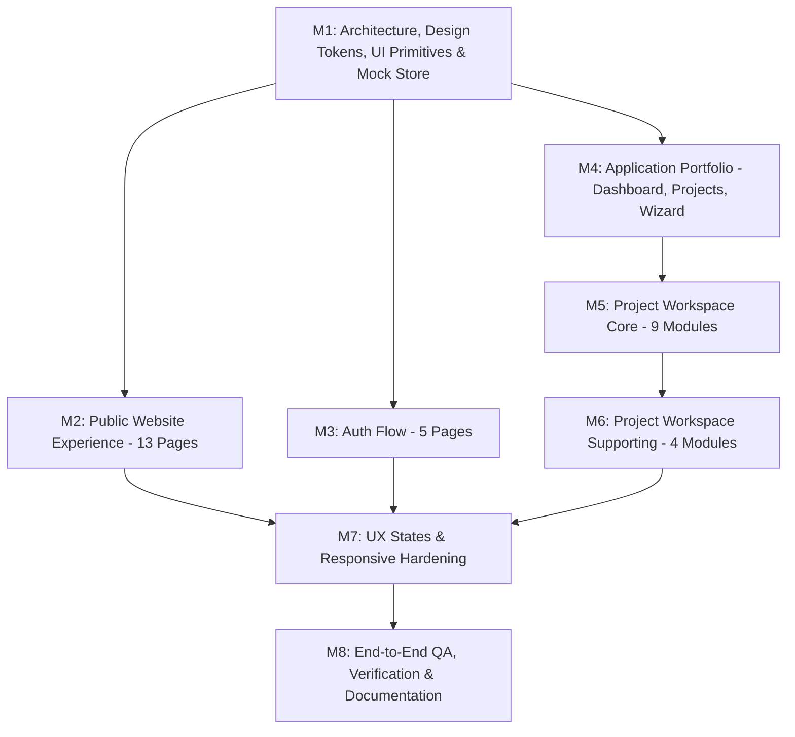

# ONGROUND — PHASE 1 FRONTEND IMPLEMENTATION PLAN
**Generated:** 2026-09-17  
**Status:** Approved for Execution Review  
**Author:** Lead Frontend Engineer & Implementation Agent  

---

## 1. Plan Overview & Objectives

The goal of Phase 1 is to build a complete, professional, navigable OnGround frontend experience using **mock data**, strictly adhering to the approved **Phase 1 Frontend Blueprint**.

### Core Flow:
$$\text{Visitor} \longrightarrow \text{Landing Page} \longrightarrow \text{Login / Signup} \longrightarrow \text{Dashboard} \longrightarrow \text{Projects} \longrightarrow \text{Project Workspace} \longrightarrow \text{Complete Workflow}$$

### Locked Execution Constraints:
1. **Home Page Polish:** The `/` landing page will receive top-tier visual polish with rich gradients, micro-animations, feature breakdowns, and live interactive previews.
2. **Reuse Existing Work:** Preserve all working reconciliation, schedule, upload, and audit components.
3. **Unified Workspace Shell:** All `/projects/:id/*` routes will share a single, cohesive Project Workspace layout with persistent project context and sidebar.
4. **Relational Mock Data:** Centralize all mock data in `src/mocks/` backed by real EPC baseline data (`data/baseline_schedule.csv`).
5. **No Production Backend Implementations:** No real payment gateways, live P6 APIs, heavy database migrations, or out-of-scope backend services.

---

## 2. Implementation Milestones

---

### Milestone 1: Foundation — Design System, UI Primitives, Layouts & Mock Store
**Objective:** Establish design tokens, common primitives, project context, and relational mock data layer without disrupting existing code.

- **1.1 Design Tokens & CSS Utilities (`src/index.css`):**
  - Add public marketing styles (hero sections, glow badges, glass cards, feature grids, responsive navbars, pricing cards, doc layouts).
  - Add design tokens for modals, drawers, tabs, breadcrumbs, and segmented controls.
- **1.2 Centralized Relational Mock Data Store (`src/mocks/`):**
  - `mockProjects.ts`: 3 detailed EPC projects (Line 247 Pipeline, Mumbai Metro Line 3, Vadodara Refinery Package 4).
  - `mockSchedule.ts`: 21 Primavera P6 baseline activities spanning all 6 EPC disciplines (CIV, PIP, ELE, INS, EQP, HSE) directly matching `data/baseline_schedule.csv`.
  - `mockReports.ts`: Daily progress reports with metadata, uploaded by, status, and activity counts.
  - `mockActivities.ts`: Extracted activities with disciplines, timestamps, and locations.
  - `mockMatches.ts`: Auto-linked, pending review, confirmed, and rejected records with confidence scores and candidate alternatives.
  - `mockTeam.ts`: Team members with roles (Planner, Supervisor, Project Manager, Site Engineer).
  - `mockAudit.ts`: Immutable audit trail records.
  - `mockAnalytics.ts`: Metric series for reports, match rates, and confidence distributions.
- **1.3 Typed Mock API Service Layer (`src/api/apiService.ts`):**
  - Unified async methods (`getProjects`, `getProjectById`, `getSchedule`, `getReports`, `uploadReport`, `getProcessingStatus`, `getReconciliationMatches`, `confirmMatch`, `rejectMatch`, `getTeam`, `getAnalytics`, `getAuditTrail`).
  - Seamless toggle between mock store and live FastAPI backend via environment flag.
- **1.4 UI Primitives (`src/components/ui/`):**
  - `Modal.tsx` & `ConfirmationDialog.tsx`
  - `Drawer.tsx`
  - `Tabs.tsx`
  - `Breadcrumbs.tsx`
  - `PageHeader.tsx`
  - `ProgressBar.tsx`
  - `Select.tsx`
- **1.5 Layout Shells (`src/components/layout/`):**
  - `PublicLayout.tsx`: Public header + nav + body + footer.
  - `AppLayout.tsx`: Portfolio level (Dashboard, Projects).
  - `ProjectWorkspaceLayout.tsx`: Project workspace with active project header, project switcher, and project-scoped sidebar.
  - `ProjectContext.tsx`: React Context managing the currently active project and its data.

---

### Milestone 2: Public Website Experience (13 Pages)
**Objective:** Build a stunning, professional, high-converting SaaS public web experience.

- **2.1 Home Page (`/`):**
  - **Highest polish level:** Hero section with headline *"Turn Daily Site Reports Into Actionable Project Data"*.
  - Supporting copy covering daily report information, AI extraction, schedule activity reconciliation, and human review for uncertain matches.
  - Interactive product preview (live interactive reconciliation demonstration card).
  - Problem Section (Fragmented site reports across disciplines, delayed progress tracking, and manual reconciliation overhead).
  - Solution Section (Unified progress intelligence, automated semantic linking to master schedules, and human-in-the-loop review for uncertain matches).
  - How It Works 7-step visual workflow preview.
  - Core Features grid with interactive tabs.
  - AI + Semantic Matching explanation section.
  - Persona Use Cases (Project Managers, Planners, Site Supervisors).
  - Security & Trust overview (Role-based access control, planner confirmation boundaries, and immutable audit logs).
  - High-impact CTA banner and comprehensive footer.
- **2.2 Features Page (`/features`):**
  - Detailed feature groups: Report Intelligence, Schedule Intelligence, Reconciliation, Collaboration, Analytics.
- **2.3 How It Works Page (`/how-it-works`):**
  - Interactive 7-step workflow: 01 Upload → 02 Extract → 03 Understand → 04 Match → 05 Review → 06 Confirm → 07 Audit.
  - Step details: What happens, Why it happens, What the user sees.
- **2.4 Solutions Page (`/solutions`):**
  - Tailored workflows for Project Managers, Planners, Site Supervisors, EPC Contractors (Problem → OnGround workflow → Benefit).
- **2.5 Pricing Page (`/pricing`):**
  - Tier cards: Free / Trial, Professional, Enterprise.
  - Clear Phase 1 UI disclaimer without unsupported claims.
- **2.6 About Page (`/about`):**
  - Company vision, problem context, product philosophy, team background.
- **2.7 Contact Page (`/contact`):**
  - Name, Work Email, Company, Role, Message, interactive submission feedback.
- **2.8 Documentation Pages (`/docs`):**
  - Docs navigation sidebar: Getting Started, How OnGround Works, Projects, Schedules, Reports, Reconciliation, Review, Analytics.
- **2.9 Security Page (`/security`):**
  - Only represents capabilities that actually exist or are explicitly documented: Role-based access control (Planner vs Site Supervisor), human-in-the-loop verification gates, immutable append-only audit trail, and baseline schedule immutability. No unverified compliance, encryption, or enterprise SSO claims.
- **2.10 FAQ Page (`/faq`):**
  - Interactive accordion addressing multi-format reports, Primavera P6 baseline structures, semantic matching confidence bands, and human review.
- **2.11 Legal Pages (`/privacy`, `/terms`, `/cookies`):**
  - Standard, clean informational compliance pages.

---

### Milestone 3: Authentication Flows (5 Pages)
**Objective:** Implement believable, polished authentication experiences.

- **3.1 Login Page (`/login`):**
  - Role switcher (Planner / Supervisor), pre-filled demo accounts, email/password fields, "Remember Me", forgot password link.
- **3.2 Signup Page (`/signup`):**
  - Full Name, Organization, Work Email, Role selection, Password, Terms acceptance.
- **3.3 Forgot Password Page (`/forgot-password`):**
  - Email input with simulated reset link dispatch and success feedback.
- **3.4 Reset Password Page (`/reset-password`):**
  - New password input, strength meter, confirmation field.
- **3.5 Verify Email Page (`/verify-email`):**
  - Verification code input boxes, resend link timer, auto-confirmation.

---

### Milestone 4: Application Portfolio Layer
**Objective:** Central command center for cross-project monitoring and new project onboarding.

- **4.1 Central Dashboard (`/dashboard`):**
  - Header: Personalized greeting, search bar, notifications drawer, user profile.
  - Global KPI Cards: Active Projects, Reports Processed, Activities Matched, Needs Review.
  - Quick Actions: New Project, Upload Report, Import Schedule, Review Matches.
  - Portfolio Sections: Recent Projects cards, Recent Reports list, Reconciliation Health chart/breakdown, Pending Reviews queue, Recent Activity feed.
- **4.2 Projects Portfolio (`/projects`):**
  - Project Cards/Table: Project Name, Client, Status (Active, Completed, Archived), Progress %, Reports count, Last Activity, Team avatars.
  - Interactive Filters: Status filter tabs, search filter, sort by progress/date.
- **4.3 Project Creation Wizard (`/projects/new`):**
  - 5-Step Wizard:
    - Step 1: Project Information (Name, Code, Client, Location).
    - Step 2: Project Details (Contract Type, Dates, Budget, Description).
    - Step 3: Import Schedule (CSV/XML upload preview with sample baseline).
    - Step 4: Team Assignment (Planners, Supervisors, Leads).
    - Step 5: Review & Complete with instant launch into workspace.

---

### Milestone 5: Core Project Workspace Modules (`/projects/:id/*`)
**Objective:** Provide the unified project workspace for day-to-day progress tracking.

- **5.1 Project Overview (`/projects/:id/overview`):**
  - Active project KPIs (Schedule Activities, Reports, Matched %, Needs Review, Unmatched).
  - Progress breakdown by discipline, recent reports, matching health visual, pending reviews queue, team activity.
- **5.2 Schedule WBS (`/projects/:id/schedule`):**
  - Master schedule table with Activity ID, WBS, Activity Name, Discipline, Start Date, End Date, Status.
  - Search, discipline filter, sort, import schedule modal, export schedule action, activity detail drawer.
- **5.3 Activities Explorer (`/projects/:id/activities`):**
  - Deep exploration table with filters: Search, Discipline, Status, Date, Match Status.
  - Comprehensive Activity Detail Drawer connecting:
    $$\text{Extracted Activity} \longrightarrow \text{Source Report} \longrightarrow \text{Schedule Activity} \longrightarrow \text{Confidence Match} \longrightarrow \text{Audit Log}$$
- **5.4 Reports List (`/projects/:id/reports`):**
  - Table: Report Name, Date, Uploaded By, Status (Uploaded, Processing, Completed, Failed), Activities Count, Matched, Review, Unmatched.
  - Actions: View Extraction, Upload New, Retry, Archive.
- **5.5 Upload Experience (`/projects/:id/reports/upload`):**
  - Drag-and-drop supporting PDF, DOCX, XLSX, CSV, TXT.
  - Interactive pre-flight checks, discipline tagger, and simulated pipeline progression.
- **5.6 Processing Pipeline Tracker (`/projects/:id/processing`):**
  - Real-time animated pipeline visualization:
    $$\text{Upload } \checkmark \longrightarrow \text{Extraction } \checkmark \longrightarrow \text{Embedding } \checkmark \longrightarrow \text{Semantic Matching } \circlearrowright \longrightarrow \text{Completed}$$
  - Simulated failure state with one-click retry.
- **5.7 Reconciliation Table (`/projects/:id/reconciliation`):**
  - Tabbed interface: **Matched** | **Needs Review** | **Unmatched**.
  - Side-by-side comparison: Daily Report Activity vs Master Baseline Activity.
  - Similarity score ($\ge 0.85$ Auto, $0.70-0.84$ Review, $<0.70$ Unmatched).
  - Inline actions: Confirm, Reject, Disambiguate / Change Match.
- **5.8 Review Interface (`/projects/:id/review` & `/review/:matchId`):**
  - Focused human-in-the-loop review card.
  - Displays reported activity, top AI suggestion (confidence %), alternative candidate matches, and planner action buttons.
- **5.9 Unmatched Pool (`/projects/:id/unmatched`):**
  - Table of unmatched progress items.
  - Actions: Search Schedule, Manual Match modal, Mark as New Baseline Activity.

---

### Milestone 6: Supporting Project Modules (`/projects/:id/*`)
**Objective:** Complete project management capabilities.

- **6.1 Project Analytics (`/projects/:id/analytics`):**
  - KPIs: Reports Processed, Activities Extracted, Match Rate %, Review Rate %.
  - Visual trends: Ingestion trend over time, Matching accuracy curve, Discipline distribution.
  - Quality metrics: Confidence band distribution, manual correction rate.
- **6.2 Project Audit Trail (`/projects/:id/audit`):**
  - Chronological timeline & table of all actions: Actor, Action type, Target object, Confidence score, Timestamp.
  - Filters: User, Action (Auto-linked, Confirmed, Rejected, Flagged), Date range.
- **6.3 Project Team Management (`/projects/:id/team`):**
  - Member cards/table: Name, Email, Role, Status, Last Active.
  - Invite Member modal, role assignment dropdown, remove member action.
- **6.4 Project Settings (`/projects/:id/settings`):**
  - Tabbed settings: General Info, Schedule Preferences, Report Upload Rules, Matching Thresholds (Auto-link $\ge 85\%$, Review $\ge 70\%$), Notifications, Danger Zone.

---

### Milestone 7: UX States & Responsive Hardening
**Objective:** Ensure every screen handles edge cases gracefully and adapts to mobile, tablet, and desktop.

- **7.1 State Handling for All Data-Driven Views:**
  - **Loading:** Shimmer skeleton states.
  - **Success / Loaded:** Coherent data presentation.
  - **Empty:** Helpful empty states with direct primary action CTA (e.g., "No Reports Uploaded Yet" → "Upload Daily Report").
  - **Error:** Clean error message with retry button.
  - **No Results:** Search filter with clear filter button.
  - **Processing:** Animated state with pipeline steps.
  - **Permission Denied:** Role-aware restriction message when a Supervisor attempts Planner-only actions.
- **7.2 Responsive Layouts:**
  - Desktop ($>1024$px): Full sidebar, multi-column grids, comprehensive tables.
  - Tablet ($768$px - $1024$px): Collapsible sidebar, 2-column grids, horizontal table scrolling.
  - Mobile ($<768$px): Slide-over drawer navigation, stacked KPI cards, compact table cards.

---

### Milestone 8: End-to-End QA, Build Verification & Documentation
**Objective:** Validate all navigation paths, links, forms, and create final project reports.

- **8.1 Routing & Navigation Verification:**
  - Test all 32 routes. Ensure back buttons, breadcrumbs, sidebar items, and action links work seamlessly.
- **8.2 TypeScript & Build Verification:**
  - Run `npm run build` to verify zero TypeScript errors and successful production build.
- **8.3 Documentation Updates:**
  - Create and maintain `docs/PHASE_1_PROGRESS.md`.
  - Create final `docs/PHASE_1_COMPLETION_REPORT.md` upon completion.

---

## 3. Route Inventory & File Mapping

| Route Category | Target URL | Target Component / File | Milestone |
|---|---|---|---|
| **Public** | `/` | `src/pages/public/HomePage.tsx` | M2 |
| **Public** | `/features` | `src/pages/public/FeaturesPage.tsx` | M2 |
| **Public** | `/how-it-works` | `src/pages/public/HowItWorksPage.tsx` | M2 |
| **Public** | `/solutions` | `src/pages/public/SolutionsPage.tsx` | M2 |
| **Public** | `/pricing` | `src/pages/public/PricingPage.tsx` | M2 |
| **Public** | `/about` | `src/pages/public/AboutPage.tsx` | M2 |
| **Public** | `/contact` | `src/pages/public/ContactPage.tsx` | M2 |
| **Public** | `/docs` | `src/pages/public/DocsPage.tsx` | M2 |
| **Public** | `/security` | `src/pages/public/SecurityPage.tsx` | M2 |
| **Public** | `/faq` | `src/pages/public/FAQPage.tsx` | M2 |
| **Public** | `/privacy` | `src/pages/public/PrivacyPage.tsx` | M2 |
| **Public** | `/terms` | `src/pages/public/TermsPage.tsx` | M2 |
| **Public** | `/cookies` | `src/pages/public/CookiesPage.tsx` | M2 |
| **Auth** | `/login` | `src/pages/auth/LoginPage.tsx` | M3 |
| **Auth** | `/signup` | `src/pages/auth/SignupPage.tsx` | M3 |
| **Auth** | `/forgot-password` | `src/pages/auth/ForgotPasswordPage.tsx` | M3 |
| **Auth** | `/reset-password` | `src/pages/auth/ResetPasswordPage.tsx` | M3 |
| **Auth** | `/verify-email` | `src/pages/auth/VerifyEmailPage.tsx` | M3 |
| **App Portfolio** | `/dashboard` | `src/pages/app/PortfolioDashboardPage.tsx` | M4 |
| **App Portfolio** | `/projects` | `src/pages/app/ProjectsPage.tsx` | M4 |
| **App Portfolio** | `/projects/new` | `src/pages/app/CreateProjectPage.tsx` | M4 |
| **Project Workspace**| `/projects/:id/overview` | `src/pages/project/ProjectOverviewPage.tsx` | M5 |
| **Project Workspace**| `/projects/:id/schedule` | `src/pages/project/ProjectSchedulePage.tsx` | M5 |
| **Project Workspace**| `/projects/:id/activities`| `src/pages/project/ProjectActivitiesPage.tsx` | M5 |
| **Project Workspace**| `/projects/:id/reports` | `src/pages/project/ProjectReportsPage.tsx` | M5 |
| **Project Workspace**| `/projects/:id/reports/upload` | `src/pages/project/ProjectUploadPage.tsx` | M5 |
| **Project Workspace**| `/projects/:id/processing`| `src/pages/project/ProjectProcessingPage.tsx`| M5 |
| **Project Workspace**| `/projects/:id/reconciliation`| `src/pages/project/ProjectReconciliationPage.tsx`| M5 |
| **Project Workspace**| `/projects/:id/review` | `src/pages/project/ProjectReviewPage.tsx` | M5 |
| **Project Workspace**| `/projects/:id/unmatched`| `src/pages/project/ProjectUnmatchedPage.tsx` | M5 |
| **Project Workspace**| `/projects/:id/analytics`| `src/pages/project/ProjectAnalyticsPage.tsx` | M6 |
| **Project Workspace**| `/projects/:id/audit` | `src/pages/project/ProjectAuditPage.tsx` | M6 |
| **Project Workspace**| `/projects/:id/team` | `src/pages/project/ProjectTeamPage.tsx` | M6 |
| **Project Workspace**| `/projects/:id/settings` | `src/pages/project/ProjectSettingsPage.tsx` | M6 |
| **Compatibility** | `/upload`, `/reconciliation`, `/schedule`, `/audit`, `/unmatched` | Redirects to `/projects/proj-01/*` | M1 |

---

## 4. Execution Rules
1. **Never break existing code:** Existing SIH demo flows remain intact via default project routing (`proj-01`).
2. **Deterministic Mock Data:** Always pull from `src/mocks/` with coherent references.
3. **Continuous Build Verification:** Execute `npm run build` after completing each milestone.
