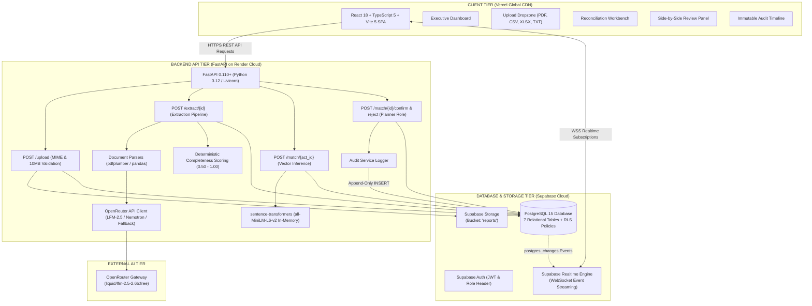
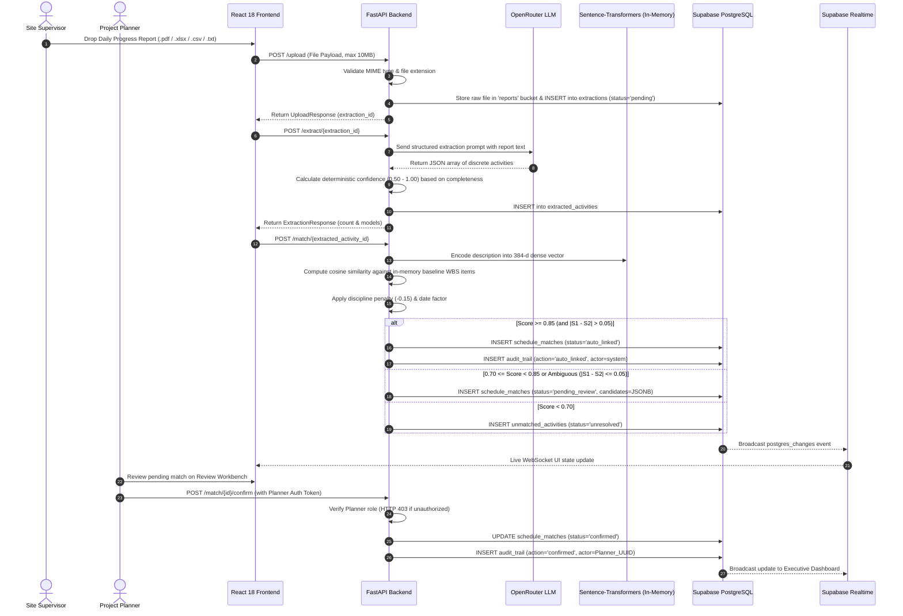
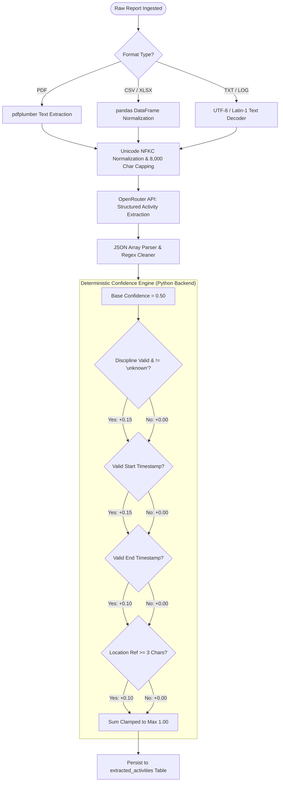
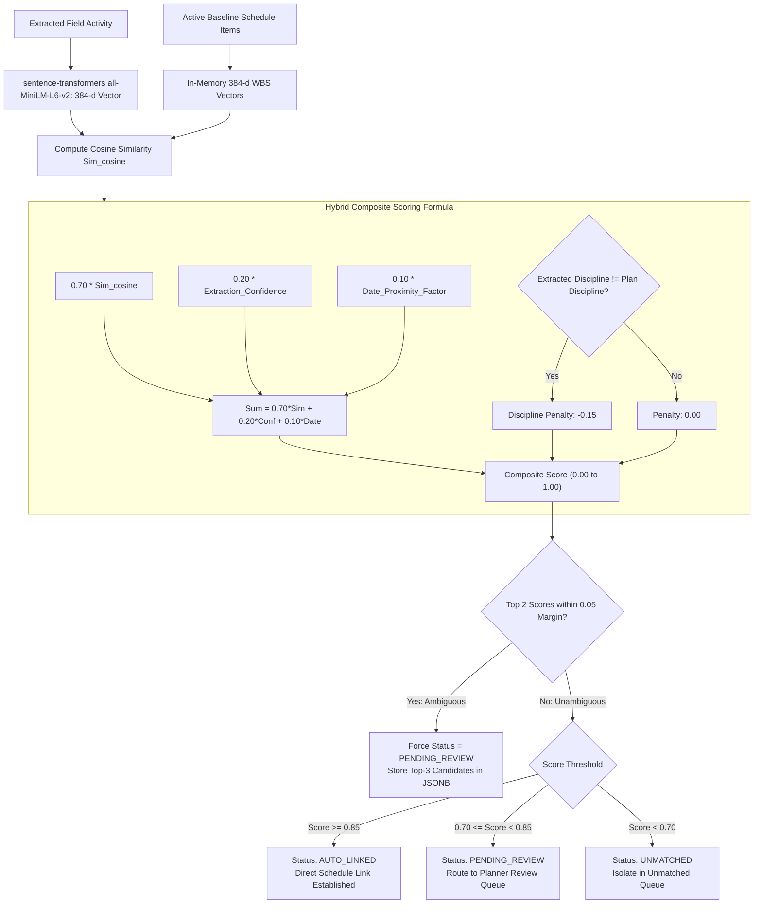
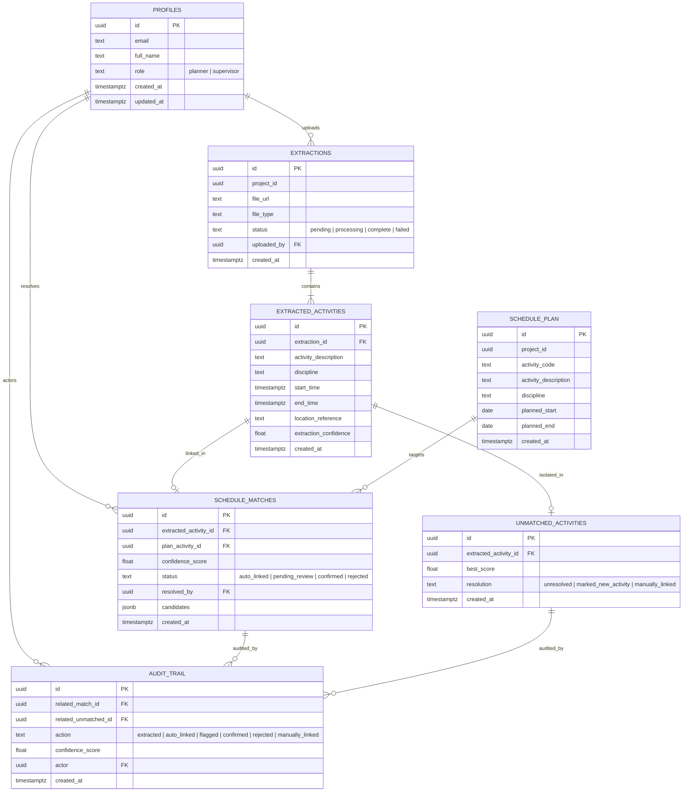
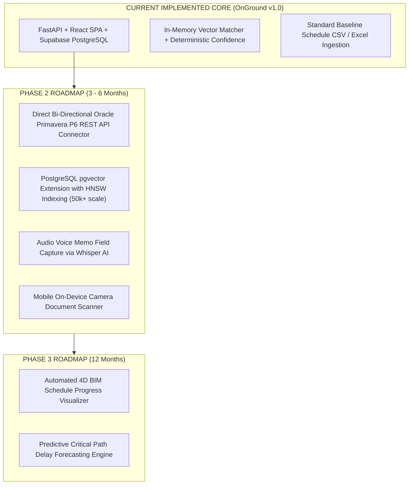

# OnGround — SIH 2026 Technical & Architectural Diagrams
**Project:** OnGround (Problem Statement ID: 26122)  
**Target Event:** Smart India Hackathon 2026 Grand Finale  
**Classification:** System Architecture, Data Flow, AI/ML & Database Diagrams  
**Factual Audit Status:** 100% Verified against Active Codebase (No Planned Features in Current Architecture)

---

## 1. Verified Active System Architecture Diagram

---

## 2. End-to-End Data Flow Pipeline

---

## 3. Verified AI Extraction & Deterministic Scoring Flow

---

## 4. Hybrid Semantic Matching & Decision Banding Algorithm

---

## 5. Database Entity Relationship (ER) Diagram (7 Implemented Tables)

---

## 6. Future Roadmap Architecture (Planned Phase 2 & 3 Ecosystem)

---
*End of Technical & Architectural Diagrams*
